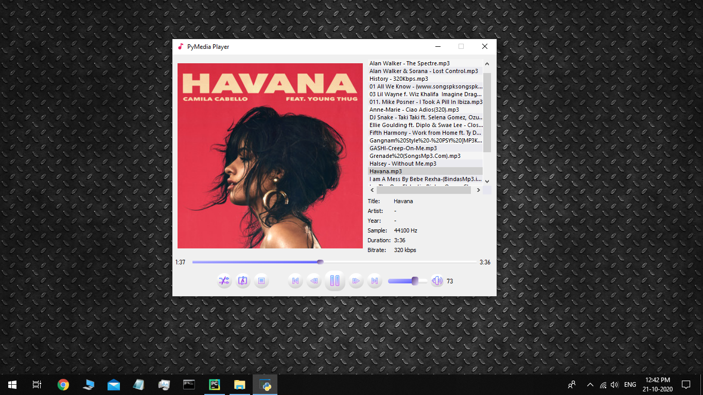
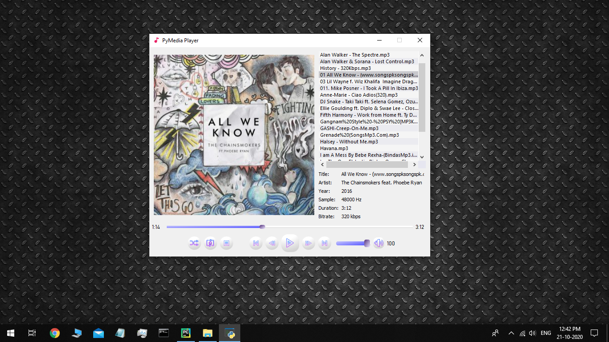

# PyMediaPlayer
A simple media player made in Python using the PyQt5 module. It is a desktop application which can play songs and also display its metadata similar to any other media playback software.

# Supported formats
It uses *Windows Media Foundation* in Windows platform, so it can play most of the supported audio formats such as **mp3, wav, aac, wma, m4a, ac3, amr, ts, flac**, .etc.

Some minor issues regarding some special formats can arise, but its all up to the media plugin that the host Operating System uses. This application is totally based on the host OS, so results can vary depending on the type and version of the host OS. 

Any contribution to this project will be highly appreciated.

# Features
1. Media playback in background.
2. Supports wide range of audio formats
3. Automatic Playback
4. Drag and drop multiple files at once
5. Media Controls - Next song, Previous song
6. Playback Controls - Play/Pause, Stop, Rewind/Fast-Forward, Skip back-forth
7. Output Controls - Mute volume, Change Playback Volume
8. PlayList Features - Repeat All, Repeat Queue, Repeat None, Repeat One, Shuffle All
9. Display Audio Info - Album Art, Title, Artist, Year, Sample Rate, Duration, Bitrate
10. Elapsed/Remaining Time Display
11. Realtime Progress Seek Bar
12. Supports keyboard shortcuts for controlling the app

# Snaps

# How to Use
1. Simply clone the repository on the local machine and compile *PyMediaPlayer.py* file.
2. Drag and drop *Audio only* files onto the Main App Window.
3. Playback will start automatically from the first file.
4. Use the control buttons to control the app's cababilities
5. Shortcuts can be used when app is in *focus*
   * Toggle Shuffle - <kbd>Alt + S</kbd>
   * Toggle Mute - <kbd>Alt + M</kbd>
  

# Connect with me
[YouTube](https://www.youtube.com/c/EverythingComputerized)

[Linkedin](https://www.linkedin.com/in/chiku1022/)
